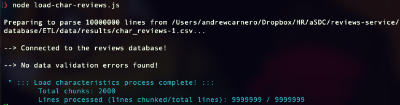
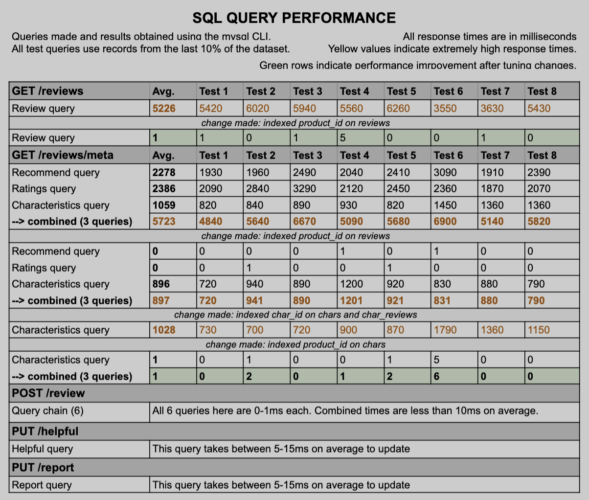
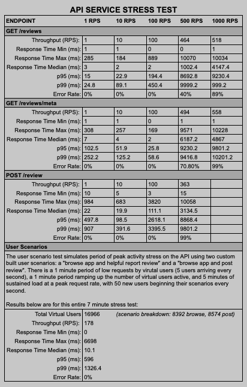

# **reviews-service**

This repository is the reviews and rating API for Atelier's new back end system.

The reviews service is served using Express and a mySQL database as a store.

**Project Contents:**
1. [Technologies](#technologies)
2. [Installation](#installation)
3. [Reviews API](#rest-api)
4. [Data Model](#data-model)
5. [ETL Process](#etl-process)
6. [Performance Tuning](#performance-tuning)
7. [Deployment](#deployment)
8. [Project Journal](#project-journal)

<br>

# **technologies**

Build
- Built using Node.js
  - node modules: filesystem, readline, mysql2
- Express
- mysql CLI

Testing
- Postman Newman CLI
- Artillery

Deployment
- Docker
- Deployed to AWS EC2

<br>
<br>

# **installation**

Fork and clone the project repository. In the cloned repository:
1. `npm i` to install project dependencies.
2. `npm start` to bring the server online.

Testing Dependencies:
- API Testing via Artillery
  1. Install the Artillery CLI `npm install -g artillery@latest` OR for Docker container/Docker images: `RUN npm install -g artillery` making sure the installation is not run as the `root` user.
  2. Check Artillery is installed: `artillery dino` (result should be an ASCII dinosaur printed to the terminal).
  3. Install the Artillery publish-metrics plugin: `npm install -g artillery-plugin-publish-metrics`
  4. To run tests: `artillery run -e staging <test-name>.yml` from the `/test/scenarios/` directory

<br>
<br>

# **REST API**

The shape of result data was required to match the shape of data as was originally specified in the previous API.

Server endpoints are defined and routed to request handlers using Express.

> ### **List Reviews**
>Returns a list of reviews for a particular product. This list does not include any reported reviews.
>`GET /reviews`
>
>| Parameter | Type | Description |
>|:---------:|:----:|:-----------:|
>| page | integer | Selects the page of results >to return. Default 1. |
>|count|integer|Specifies how many results per >page to return. Default 5.|
>|sort|text|Changes the sort order of reviews to >be based on "newest", "helpful", or "relevant"|
>|product_id|integer|Specifies the product for which to retrieve reviews.|
>
>`Response: 200 OK`

<details>
 <summary>Expand to view sample response body</summary>

```
{
  "product": "2",
  "page": 0,
  "count": 5,
  "results": [
    {
      "review_id": 5,
      "rating": 3,
      "summary": "I'm enjoying wearing these shades",
      "recommend": false,
      "response": null,
      "body": "Comfortable and practical.",
      "date": "2019-04-14T00:00:00.000Z",
      "reviewer_name": "shortandsweeet",
      "helpfulness": 5,
      "photos": [{
          "id": 1,
          "url": "urlplaceholder/review_5_photo_number_1.jpg"
        },
        {
          "id": 2,
          "url": "urlplaceholder/review_5_photo_number_2.jpg"
        },
        // ...
      ]
    },
    {
      "review_id": 3,
      "rating": 4,
      "summary": "I am liking these glasses",
      "recommend": false,
      "response": "Glad you're enjoying the product!",
      "body": "They are very dark. But that's good because I'm in very sunny spots",
      "date": "2019-06-23T00:00:00.000Z",
      "reviewer_name": "bigbrotherbenjamin",
      "helpfulness": 5,
      "photos": [],
    },
    // ...
  ]
}
```
</details>

<br>

> ### **Review Metadata**
>Gets a review metadata for the specified product.
>
>`GET /reviews/meta`
>| Parameter | Type | Description |
>|:---------:|:----:|:-----------:|
>|product_id|integer|Required ID of the product for which data should be returned.|
>
>`Response: 200 OK`

<details>
 <summary>Expand to view sample response body</summary>

```
{
  "product_id": "2",
  "ratings": {
    2: 1,
    3: 1,
    4: 2,
    // ...
  },
  "recommended": {
    0: 5
    // ...
  },
  "characteristics": {
    "Size": {
      "id": 14,
      "value": "4.0000"
    },
    "Width": {
      "id": 15,
      "value": "3.5000"
    },
    "Comfort": {
      "id": 16,
      "value": "4.0000"
    },
    // ...
}
```
</details>

<br>

> ### **Add a New Review**
>Adds a review for the specified product.
>
>`POST /reviews`
>| Parameter | Type | Description |
>|:---------:|:----:|:-----------:|
>|product_id|integer|Required ID of the product for which data should be returned.|
>| rating | integer | Integer (1-5) indicating the review rating |
>|summary|string|Summary text of the review|
>|body|string|Continued or full text of the review|
>|recommend|boolean|Value indicating if the reviewer recommends the product|
>|name|string|Username for question asker|
>|email|string|Email address for question asker
>|photos|[string]|Array of text urls that link to images to be shown|
>|characteristics|object|	Object of keys representing characteristic_id and values representing the review value for that characteristic. { "14": 5, "15": 5 //...}|

>`Response: 201 CREATED`

<br>

> ### **Mark Review Helpful**
>Updates a review to show it was found helpful.
>
>`POST /reviews`
>| Parameter | Type | Description |
>|:---------:|:----:|:-----------:|
>|review_id|integer|Required ID of the review to update|
>
>`Response: 204 NO CONTENT`

<br>

> ### **Report a Review**
>Updates a review to show it was reported. Note, this action does not delete the review, but the review will not be returned in the above GET request.
>
>`POST /reviews`
>| Parameter | Type | Description |
>|:---------:|:----:|:-----------:|
>|review_id|integer|Required ID of the review to update|
>
>`Response: 204 NO CONTENT`

<br>
<br>

# **data model**

**Final version:** 4.0 - 1/17/22


**Version History**
- [v 3.0][version3] 1/12/22
- [v 2.0][version2] 1/11/22
- [v 1.0][version1] 1/10/22

[version3]: ./resources/data-models/sql-modelv3.png
[version2]: ./resources/data-models/sql-modelv2.png
[version1]: ./resources/data-models/sql-modelv1.png

<br>
<br>

# **ETL process**

The following preexisting data had to be ingested into the new back end architecture:

| Table | Fields | Records |
|:----- | ------ | ------------ |
| Photos | 3     | 2,742,832    |
| Users  | 3     | 3,620,848    |
| Chars | 3      | 3,347,478    |
| Reviews | 11   | 5,777,922    |
| Char_Reviews | 4 | 19,337,415 |
| Total | -      | 34,826,495   |

A custom-built extract, transform, load process was built first using only Bash scripts and then additionally using node.

The process was unworkably slow at first. After a few iterations and optimization, an acceptable ingestion rate was achieved.

## **version 1: Bash**

- Bash was used to extract, validate, and insert data into the mySQL database.
- First load rate was **18 records inserted per second (RPS)** (12 fields)
- In an attempt to discover ingestion bottlenecks, I isolated transforming the data to it's own script

  - 1 mil lines transformed at about 1190 lines per second
- Isolated data transformation was performing slow, I did some benchmarking on singular fileds to see if that might improve transform speeds:

  - 1 mil lines transformed at 3,703 records per second
- While running the transact process separately allowed me to validate my dataset much faster, I still had issues with slow data load times into my database

## **version 2: node/JS**

- Bash was a fine solution to split up the .CSV files by line but beyond that, required too much time to build and optimize.
- I decided a Node.js would proccess transformation and loading much faster.
  - Modules used:
    - filesystem
    - readline
    - mysql2
  - I created a read stream to build bulk mySQL queries. Inserting 5,000 values per query was quick to transform and quick to load. Below is a screenshot of the result of transforming and loading using the char-reviews script:



Initial benchmarking of my reviews load script:
>Time (min:sec | sec | insert per sec) for 500k mySQL inserts:
>1. 9:14 | 554 | 902
>2. 8:37 | 517 |  967
>3. 9:20 | 560 | 892
>4. 9:28 | 568 | 880
>5. 9:30 | 570 | 877
>6. 12:00 | 720 | 695
>7. 12:20 | 740 | 675
>8. 10:45 | 645 | 775 \
>Average inserts per second: 834, a **4,633% improvement** over my Bash script!

I was certain I could improve these load times further. I added a buffering system that chunks a specified amount of values to insert (I found 5,000 to be optimal) and then uses a single mySQL query to insert them all. Then, the buffer is reset and continues on with the next set of values.
- 250 insert queries were made (down from 500,000 previously)
- 2.74m lines, 3 fields: **Averaging 35,868 RPS**
  - Up from 834, a **4900% RPS increase** from the previous script and a whopping **198,000% RPS increase** from the Bash script!
- 3.34m lines, 4 fields: Averaging **79,700 RPS**

Using this optimized version of my load script, it seeding my database of 34 million lines took less than 20 minutes!

<br>
<br>


# **performance tuning**

## **database**

The Reviews service utilizes 12 queries to obtain response data for all of the request endpoints.
- In their first iteration, two read queries, naturally the most complex queries, were majorly problematic: `GET /reviews` and `GET /reviews/meta`.
- Respectively, these queries took, on average, 5.2 and 5.7 seconds to complete.
- After indexing selected columns in certain tables, these queries, along with all other queries in the service, respond on average within 1 second.
- Data from the query tests before and after indexing changes is displayed below:



## **api service**

The API was benchmarked locally using **Artillery** to be able to identify any major problems prior to deploying and to compare against benchmark testing post-deployment done from the cloud.
- Each endpoint was stress tested for a minute at rates of 1, 10, 100, 500, and 1000 RPS.
- Additionally, a peak browing simulation was configued and ran for 7 minutes.
- The results of the stress tests are blow:



<br>
<br>

# **deployment**

First, the database was deployed to its own AWS: EC2 instance.

Second, the server was Dockerized and then deployed to an additional AWS: EC2 instance

<br>
<br>

# **project journal**

You can read a daily record of engineering notes for this project [here](https://vagabond-papaya-2c5.notion.site/36e2556afa6849c488e6ff99cf762ab5?v=c6bd8b96f66a4c37b43d2ee8c08bfc5f).
