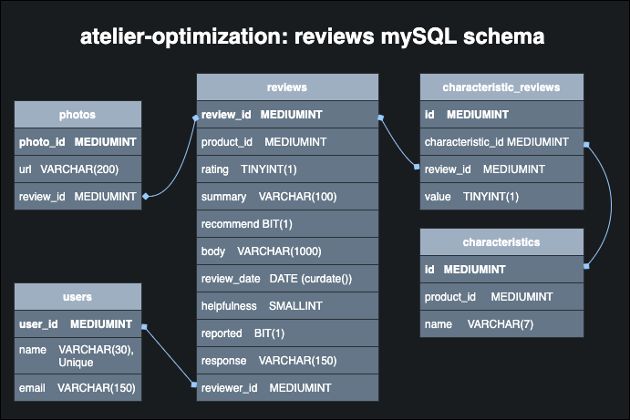

# **reviews-service**

This repository is the reviews and rating API for Atelier's new back end system.

The reviews service is designed using a an Express server and a mySQL database.

[reviews API](#reviews-api) |
[data model](#data-model) |
[ETL process](#etl-process)

# **reviews API**

API endpoints here

# **data model**

current version: 3.0, 1/17/22

Version History
- [v 2.0][version1] 1/11/22
- [v 1.0][version1] 1/10/22

[version1]: ./data_models/sql-modelv1.png
[version2]: ./data_models/sql-modelv4.png

# **ETL Process**

After building the new back end architecture, existing data had to be migrated over.

A custom-built extract, transform, load process was built first using only Bash scripts and then additionally using node. The process was unacceptably slow at the beginning, but after a few iterations and optimization, an acceptable ingestion rate was achieved.

### **Version 1: Bash**

- Bash was used to extract, validate, and insert data into the mySQL database.

