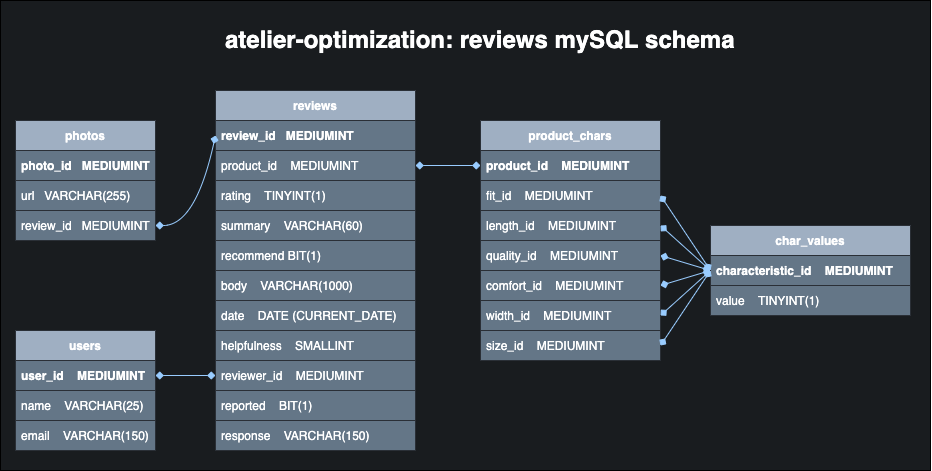

# **reviews-service**

This repository is the reviews and rating API for Atelier's new back end system.

The reviews service is designed using a an Express server and a mySQL database.

[reviews API](#reviews-api) |
[data model](#data-model) |
[statistics](#statistics)

# reviews API

API endpoints here

# data model

current version: 2.0, 1/11/22

Version History
- [v 1.0][version1] 1/10/22

[version1]: ./data_models/sql-modelv1.png

# statistics

